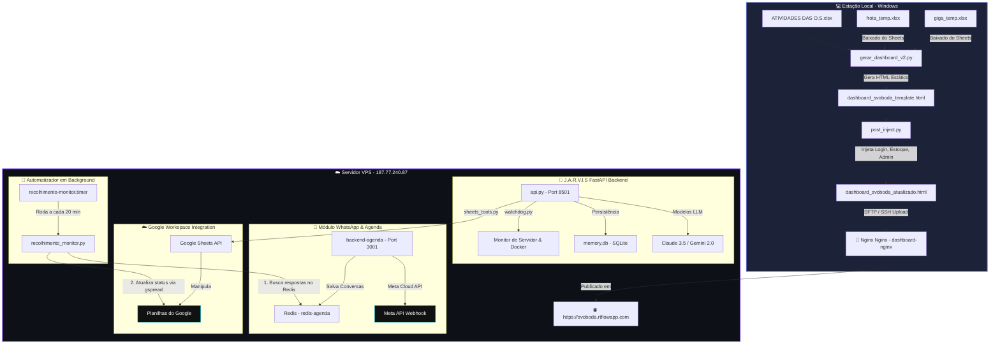

# 📊 ECOSSISTEMA SVOBODA TELECOMUNICAÇÕES
### *Documento de Requisitos do Produto (PRD) & Especificação Técnica Completa*
*Autor: Antigravity AI Partner | Versão: 3.5 (Premium) | Data: Maio de 2026*

---

## 🚀 1. Visão Geral e Propósito do Sistema

O **Ecossistema de Automação e BI da Svoboda Telecomunicações** é uma solução corporativa robusta desenvolvida para **Rodrigo Svoboda (Gestor de Campo)**. O sistema integra operações de campo, controle de frota veicular, gestão de estoques, auditoria de ordens de serviço (O.S.) e automação de contatos de WhatsApp em uma plataforma unificada e inteligente.

O ecossistema é composto por dois pilares fundamentais:
1. **Painel Operacional (Dashboard)**: Uma interface web reativa de alta performance, atualizada automaticamente a partir de dados de planilhas locais e na nuvem, que apresenta indicadores chave de desempenho (KPIs), rankings de técnicos, custos de deslocamento, controle de manutenção e controle de estoque de materiais em tempo real.
2. **J.A.R.V.I.S. (IA Assistente)**: Um assistente inteligente de inteligência artificial de dupla arquitetura (Claude + Gemini) rodando em uma VPS própria, conectado diretamente ao banco de dados Redis do WhatsApp e às planilhas corporativas do Google Sheets. Ele responde dúvidas, altera escalas, gerencia coletas de materiais de recolhimento de forma automatizada e monitora a saúde do servidor.

---

## 🏗️ 2. Arquitetura Integrada do Sistema

O sistema é distribuído de forma híbrida entre a **estação local do gestor de campo (Windows)** e um **servidor VPS dedicado (Linux)**.



### 🖥️ Ambiente Local vs. ☁️ Servidor VPS

| Característica | Estação Local (Windows) | Servidor VPS (Linux - Ubuntu) |
| :--- | :--- | :--- |
| **Função Principal** | Geração e compilação do dashboard, orquestração de arquivos locais de O.S. e upload de arquivos. | Hospedagem do dashboard publicado, processamento do Jarvis backend, banco de dados Redis do WhatsApp, monitor de recolhimento automático. |
| **Principais Componentes** | `gerar_dashboard_v2.py`, `post_inject.py`, `rodar_gerador.py`, `ATUALIZAR_DASHBOARD.bat` | `api.py` (FastAPI), Nginx (Docker), `backend-agenda` (Node.js), `recolhimento_monitor.py` |
| **Segurança** | Autenticação local básica, arquivos `.xlsx` protegidos, `.gitignore` no diretório raiz. | SSL via Traefik, restrições de IP, containers isolados Docker, systemd services protegidos. |
| **Localização Física** | `C:\Users\SVOBODA\Desktop\DASHBOARD\` | IP `187.77.240.87`, arquivos localizados em `/docker/` e `/opt/jarvis/` |

---

## 📁 3. Estrutura de Diretórios e Componentes

### 📂 Diretório do Dashboard Local (`C:\Users\SVOBODA\Desktop\DASHBOARD\`)

Este repositório é responsável pela engine de compilação estática do dashboard.

```
DASHBOARD/
├── .git/                                 # Controle de versão (https://github.com/rodrigobraganca30-cyber/dashboard.git)
├── .gitignore                            # Protege credenciais, cache e arquivos volumosos (.xlsx, .csv, .json)
├── ATIVIDADES DAS O.S.xlsx               # Planilha principal local com histórico bruto de O.S.
├── ATUALIZAR_DASHBOARD.bat               # Executável Windows (Double-Click) para rodar o pipeline inteiro local
├── config_servidor.json                  # Parâmetros de conexão SFTP do servidor VPS (Ocultado do git)
├── dashboard_svoboda_template.html       # Arquivo modelo base (CSS e HTML estrutural puro)
├── dashboard_svoboda_atualizado.html     # HTML final compilado que será enviado para o servidor
├── gerar_dashboard_v2.py                 # Core do gerador (117KB): Processa as planilhas Excel e cospe o HTML principal
├── indicadores_html_gen.py               # Gerador complementar de layouts HTML para os indicadores operacionais (38KB)
├── indicadores_tecnico_bloco.py          # Bloco que monta os cartões individuais de desempenho por técnico (9KB)
├── post_inject.py                        # Pós-processador (17KB): Injeta JavaScript, Abas Extras (Estoque) e Login Guard
├── whatsapp_agenda_gen.py                # Gerador da agenda de WhatsApp integrada ao dashboard (105KB)
└── frota_temp.xlsx / giga_temp.xlsx       # Arquivos baixados e gerados no ciclo de compilação
```

### 📂 Diretório do Jarvis na VPS e Local (`C:\Users\SVOBODA\Desktop\JARVIS\` / `/opt/jarvis/`)

Este diretório gerencia o assistente Jarvis e os sistemas de monitoramento automático na VPS.

```
JARVIS/
├── .env                                  # Chaves de API (Meta, Anthropic, Gemini) e IDs de planilhas do Google (Ocultado)
├── api.py                                # API Backend FastAPI (22KB): Lógica do Jarvis (Gemini/Claude) e memória SQLite
├── memory.py                             # Módulo de memória SQLite e persistência a longo prazo do Jarvis (12KB)
├── monitor.py                            # Utilitários de diagnóstico do servidor VPS, uso de CPU/RAM e containers Docker
├── sheets_tools.py                       # Integração total (47KB) com as planilhas Google Sheets corporativas (5 ferramentas)
├── agenda_tools.py                       # Conexão do Jarvis com o backend de conversas do WhatsApp (Redis)
├── recolhimento_monitor.py               # Robô em background que checa respostas no WhatsApp e atualiza o Sheets (6KB)
├── watchdog.py                           # Sistema de alertas ativos de indisponibilidade do servidor ou serviços do painel
└── gen-lang-client-*.json                # Credenciais da conta de serviço Google Cloud para manipulação do Sheets
```

---

## 📊 4. Pipeline de Compilação do Dashboard (Local → VPS)

A geração do dashboard foi projetada como um pipeline sequencial de alto rendimento. Com apenas um clique no arquivo `ATUALIZAR_DASHBOARD.bat`, a seguinte cadeia de eventos é disparada:

```
[Iniciar Bat] 
      │
      ▼
[1. Baixar Google Sheets] ────► Realiza o download de 'frota_temp.xlsx' e 'giga_temp.xlsx' via HTTPS
      │
      ▼
[2. Processar O.S. (Excel)] ──► 'gerar_dashboard_v2.py' analisa atividades, calcula tempos, SLAs e monta o esqueleto HTML
      │
      ▼
[3. Compilar Agenda WA] ──────► 'whatsapp_agenda_gen.py' cruza com agendamentos do dia seguinte
      │
      ▼
[4. Rodar post_inject.py] ────► Executa correções cirúrgicas no HTML gerado, adicionando as camadas de segurança e a Aba Estoque
      │
      ▼
[5. Upload via SFTP] ─────────► Envia 'dashboard_svoboda_atualizado.html' como 'index.html' para a VPS na pasta de publicação
      │
      ▼
[Pipeline Concluído] ─────────► O painel em 'https://svoboda.rtflowapp.com' atualiza instantaneamente para todos os usuários
```

### 📝 Descrição Detalhada dos Scripts do Pipeline:

#### A. `gerar_dashboard_v2.py`
Analisa a planilha local `ATIVIDADES DAS O.S.xlsx`. Ela executa as seguintes etapas:
* **Mapeamento Robusto de Colunas**: Normaliza os cabeçalhos das planilhas retirando acentos para encontrar dinamicamente as colunas importantes (`Recurso` (Técnico), `Data`, `Status da Atividade`, `Cidade`, `Tipo de Atividade`, `Motivo de Encerramento`, `Duração`, `Tempo de Deslocamento` e `Fim do SLA`).
* **Cálculo de Desempenho e Produtividade**: Gera gráficos do tipo rosca (Donut SVG puro) do status geral de ordens de serviço (Concluída, Cancelada, Não Concluída, Suspensa, Pendente).
* **Auditoria de SLA de Ativação**: Coleta e classifica em tempo real ativações pendentes, verificando de forma regressiva o tempo restante de SLA ou computando estouro de prazo.
* **Módulo Frota e Combustível**: Realiza download automático da planilha de controle de frotas da nuvem, analisa frotas em atividade, veículos em oficina (e dias parados), veículos com revisão pendente, ranking de consumo financeiro por litro/tecnico, projeções financeiras para 30 dias e gastos com viagens de deslocamento.
* **Integração GIGA+**: Lê e consolida a planilha de metas e indicadores operacionais `PAINEL GIGA+`.

#### B. `post_inject.py`
Para evitar ter que manter lógicas pesadas de banco de dados ou reescrever arquivos de template gigantescos do front-end, o `post_inject.py` atua diretamente sobre o HTML final gerado. Suas funções incluem:
1. **Login Guard**: Injeta um script JavaScript no cabeçalho do documento (`<head>`). Caso a chave `tf_auth` não esteja definida com o valor `"ok"` na `sessionStorage`, a página é redirecionada imediatamente para `login.html`.
2. **Botões Admin & Logout**: Adiciona de forma inteligente botões de logout rápido e gerenciamento de usuários no header, puxando dinamicamente o nome do usuário logado na sessão (`sessionStorage.getItem("tf_user")`).
3. **Mapeamento de Planilhas e Status**: Adiciona dropdowns extensos com 23 opções reais de status do sistema de O.S. (ex: *Confirmado*, *Normalizado*, *Conveniente*, *Aberto Reparo*, *Problema na Rede*, *Sem Contato*, *Suspenso por Débito*), permitindo filtragens personalizadas.
4. **Módulo de Consumo de Estoque Dinâmico (Aba Estoque)**: Injeta uma aplicação SPA (Single Page Application) JavaScript inteira dentro da aba `#estoque`. Esta aplicação baixa dinamicamente no navegador os arquivos semanais de inventário (`inventario_DD-MM-AAAA.xlsx`), analisa a seção "Instalado" para deduzir o consumo semanal de materiais de cada técnico, confronta com metas definidas em `localStorage` e permite a exportação dos dados processados diretamente para um arquivo Excel (`consumo_semanal.xlsx`) via biblioteca `xlsx.js`.

---

## 🤖 5. J.A.R.V.I.S. — FastAPI Backend & IA de Dupla Arquitetura

O assistente **J.A.R.V.I.S.** é o cérebro que gerencia as interações administrativas. Ele fica hospedado na VPS na pasta `/opt/jarvis/` e roda em uma API FastAPI de alta eficiência (porta `8501`).

### 🧠 Dupla Arquitetura de Inteligência Artificial com Fallback Automático

O Jarvis foi implementado sob uma estratégia de **redundância industrial**. Ele suporta duas engines de LLM simultaneamente:
1. **Google Gemini (Padrão)**: Utiliza a SDK oficial do Google (`google-genai`), rodando o modelo ultra-rápido de última geração `gemini-2.0-flash`.
2. **Anthropic Claude (Reserva / Fallback)**: Caso a API do Google retorne erro, instabilidade ou timeout, o backend do Jarvis redireciona a requisição de forma silenciosa para o modelo `claude-3-5-sonnet` da Anthropic, garantindo que o gestor nunca fique sem atendimento.

### 💾 Memória Persistente e Gerenciador de Fatos (`memory.py`)

Diferente de assistentes convencionais sem memória, o Jarvis possui uma estrutura de dados dedicada construída em **SQLite** local (`memory.db`), permitindo:
* **Histórico de Sessões**: Grava o histórico de todas as mensagens por ID de sessão de chat.
* **Memória a Longo Prazo (Fatos)**: O Jarvis consegue armazenar "Fatos" estruturados. Quando o usuário ensina algo importante, a IA chama a função `save_fact()` e grava a informação. O prompt de sistema é montado em tempo real contendo um bloco de fatos conhecidos.
* **Gerenciador de Demandas e Tarefas (`add_dev_task`)**: Possui um banco de tarefas de desenvolvimento integrado para acompanhar metas pendentes.

### 🛠️ Lista de Ferramentas (Tools) Disponíveis para a IA

O Jarvis possui acesso a funções nativas que são mapeadas e disponibilizadas para os modelos de IA usarem de forma autônoma:

```
┌───────────────────────────────────────────────────────────────────────────────────────────┐
│                                    🛠️ JARVIS IA TOOLS                                     │
├─────────────────────────────────────┬─────────────────────────────────────────────────────┤
│ Ferramenta (Tool Name)              │ Função do Sistema                                   │
├─────────────────────────────────────┼─────────────────────────────────────────────────────┤
│ controle_maio_listar(filtros)       │ Lista registros da planilha principal Controle Maio │
│ controle_maio_abas()                │ Lista as abas disponíveis na planilha Controle Maio  │
│ controle_maio_editar(row, data)     │ Modifica células específicas em qualquer aba        │
│ controle_maio_adicionar(data)       │ Insere novas linhas de registros nas planilhas      │
│ controle_maio_deletar(row)          │ Remove linhas de registros em abas ativas           │
│ server_status_tool()                │ Verifica saúde do servidor, CPU, RAM, disco e Docker│
│ server_logs_tool(container)         │ Puxa logs de depuração de containers específicos    │
│ server_restart_tool(container)      │ Reinicia containers Docker ativos via API protegida │
│ robot_status_tool()                 │ Checa o status e atividade do gerador do dashboard  │
│ robot_data_tool()                   │ Puxa estatísticas de rodadas e volumetria do robô   │
│ get_active_alerts()                 │ Lista incidentes abertos no watchdog do sistema     │
└─────────────────────────────────────┴─────────────────────────────────────────────────────┘
```

> [!IMPORTANT]
> **Regra Crítica de Segurança do Jarvis:**
> Ações de leitura (`listar`, `abas`, `status`) são executadas livremente. 
> Ações de escrita (`editar`, `adicionar`, `deletar`, `reiniciar`) **obrigatoriamente exigem confirmação explícita do usuário** na interface de chat. O Jarvis exibirá o diff da alteração esperada antes de prosseguir.

---

## 💬 6. Módulo WhatsApp, Agenda e Monitor de Recolhimento

A Svoboda Telecomunicações utiliza o WhatsApp como canal ativo de logística reversa e reagendamentos de clientes.

### ⚙️ Integração do WhatsApp e Redis

* **WhatsApp Agenda Backend**: Uma aplicação Node.js (`backend-agenda`) roda em um container Docker, gerenciando conexões de Webhook e integrando-se com a API de Nuvem da Meta.
* **Persistência de Mensagens no Redis**: Todas as mensagens disparadas ou respondidas pelos clientes são gravadas em chaves individuais no Redis estruturadas como `agenda:msgs:{phone}` em formato JSON contendo o conteúdo, timestamp e o remetente (`"from": "client"` ou `"from": "api"`).

### 🔄 Robô Monitor de Recolhimento (`recolhimento_monitor.py`)

Este módulo é um dos componentes de maior impacto operacional na Svoboda Telecomunicações. Ele elimina o trabalho manual de verificação visual de respostas de clientes que receberam mensagens de devolução de equipamentos.

#### Funcionamento Técnico Detalhado:
1. **Timer Dedicado**: O robô roda em background no servidor Linux VPS orquestrado por um temporizador do sistema (**Systemd Timer** `recolhimento-monitor.timer`) em intervalos de **20 minutos**.
2. **Leitura da Planilha de Controle**: Conecta-se à planilha Google Sheets `CONTROLE_MAIO` utilizando credenciais de conta de serviço Google Cloud e lê a aba **RECOLHIMENTO**.
3. **Mapeamento de Telefones**: Percorre cada linha da aba recolhimento mapeando a coluna `whatsapp` e `nome_cliente`. Ele ignora registros que já possuem preenchimento na coluna `CLIENTE RESPONDEU?`.
4. **Normalização**: Limpa os telefones cadastrados, extraindo caracteres não-numéricos e garantindo a inclusão automática do código de país do Brasil (`55`).
5. **Consulta ao Redis**: Efetua conexões de alta velocidade com o banco de dados Redis (`redis-agenda`) em busca da chave correspondente ao cliente (`agenda:msgs:{telefone_normalizado}`).
6. **Verificação de Resposta**: Abre o histórico de mensagens salvas em JSON e pesquisa a ocorrência de pelo menos uma mensagem contendo `"from": "client"`.
7. **Atualização Otimizada**: Caso detecte a resposta do cliente, ele agenda a atualização da coluna `CLIENTE RESPONDEU?` correspondente com o texto **`cliente com retorno`**.
8. **Batch Update (Evitando Rate Limits)**: Para não estourar a cota de uso da API do Google Sheets, o robô não faz uma requisição para cada alteração. Ele agrupa todas as atualizações necessárias em memória e efetua um único disparo de alteração otimizada em lote utilizando `ws.update_cells()`.

---

## 📈 7. Planilhas Integradas ao Ecossistema Google Sheets

O Jarvis e o monitor do WhatsApp são alimentados por planilhas hospedadas de forma compartilhada no Google Drive corporativo. A conta de serviço do Jarvis possui acesso total para manipulação destas planilhas:

* **Conta de Serviço Integrada**: `jarvis-sheets@gen-lang-client-0117119143.iam.gserviceaccount.com`

### 📊 Mapeamento das Planilhas de Produção

#### 🚗 Planilha: `FROTA_KM`
* **Google Sheet ID**: `17vJzHD6RPzEvSiBJA1hW_ZCV4VL5D7o5t7lv-h93KLI`
* **Finalidade**: Armazena registros reais de deslocamentos diários de técnicos e monitora a quilometragem mensal de frotas ativas.

#### 🔧 Planilha: `FROTA_VEICULOS`
* **Google Sheet ID**: `1CjWOfMTQQ1aP3jeF-Wf3gxIa5DT0qMRwjijD6nXXtQg`
* **Finalidade**: Contém a escala física de Placas de carros vinculadas a Técnicos de Campo, veículos em Oficina (incluindo datas de entrada, previsão de saída e observações), Revisões Pendentes e tabelas de consumo de combustível.

#### 🗓️ Planilha: `CONTROLE_MAIO`
* **Google Sheet ID**: `18YQQRy8UkrMw0j-l6RHOxgBnooCFitjkzBLK8XcLJtw`
* **Finalidade**: Orquestrador operacional principal da empresa no mês de Maio de 2026.
* **Abas Integradas e Acessíveis via Jarvis**:
  * `ESCALA`: Escala horária de trabalho das equipes de campo.
  * `RECOLHIMENTO`: Planilha de logística reversa e retorno de equipamentos monitorada pelo robô.
  * `BACKLOG`: Controle de ordens de serviço pendentes.
  * `REPARO 24H C.18` & `TRATATIVA 48H`: SLA de reparos rápidos.
  * `TRATATIVA BACKLOG C.15` / `TRATATIVA IFI` / `TRATATIVA IRR`: Relatórios setoriais de controle interno.
  * `PAINEL GIGA` & `AGENDA GIGA+` & `AGENDA AMO` & `AGENDA DESK`: Painéis e programações de visitas.
  * `PT GIGA+` & `PT DESK` & `PT AMO`: Planilhas de pontuação e produtividade técnica.
  * `LOGINS`: Parâmetros de autenticação e credenciais administrativas de técnicos do dashboard.

---

## 🔐 8. Segurança, Autenticação e Configuração

A segurança das informações da Svoboda Telecomunicações é tratada com extrema seriedade em todos os elos do sistema.

### 🛡️ Proteção de Credenciais e Arquivos Locais (`.gitignore`)
Para evitar qualquer vazamento acidental de chaves privadas e dados corporativos no repositório público do GitHub, o arquivo `.gitignore` no diretório raiz do Dashboard bloqueia explicitamente o rastreamento dos seguintes arquivos:
* Credenciais de API e senhas (`*.json`, `*.env`).
* Planilhas Excel de dados de atividades (`*.xlsx`, `*.xls`).
* Planilhas de relatórios ou exportação (`*.csv`).
* Páginas HTML gigantes que servem como backup de visualizações anteriores (`*backup*.html`).
* Diretórios temporários de compiladores de Python (`__pycache__/`).

### 🔑 Controle de Acesso no Dashboard (`login.html` & `auth_api.py`)
* O acesso ao dashboard `https://svoboda.rtflowapp.com` é restrito por uma tela de login moderna.
* O sistema verifica credenciais cadastradas que correspondem ao banco de dados administrativo de logins cadastrados na planilha `LOGINS`.
* Usuários autenticados recebem um token de sessão salvo de forma isolada na `sessionStorage`, e qualquer tentativa de burlar a visualização recarrega a página de login automaticamente (Login Guard).

---

## 🛠️ 9. Guia de Operação e Implantação do Ecossistema

### 🚀 Como Atualizar o Dashboard Dinâmico (Fluxo Local)
Sempre que novas ordens de serviço ou dados de frotas forem lançados, o gestor de campo pode atualizar o painel geral em menos de um minuto seguindo este processo:
1. Abra a pasta `C:\Users\SVOBODA\Desktop\DASHBOARD\` no computador local.
2. Dê dois cliques no executável de lote **`ATUALIZAR_DASHBOARD.bat`**.
3. O prompt do Windows abrirá, baixará automaticamente os dados mais recentes do Google Sheets, compilará os indicadores operacionais do dashboard estático, injetará os scripts inteligentes, aplicará o login guard e efetuará o upload seguro SFTP para a VPS automaticamente.

### 🐳 Gerenciamento da Infraestrutura na VPS Linux
Todos os serviços da VPS rodam encapsulados sob o ecossistema Docker para máxima estabilidade e isolamento.

#### Comandos Úteis de Gerenciamento da VPS:

* **Reiniciar o Jarvis AI Backend**:
  ```bash
  systemctl restart jarvis
  ```
* **Verificar Logs em Tempo Real do Jarvis**:
  ```bash
  journalctl -u jarvis -f -n 100
  ```
* **Verificar Status do Robô Recolhimento de WhatsApp**:
  ```bash
  systemctl status recolhimento-monitor.service
  ```
* **Forçar Execução Manual Imediata do Robô Recolhimento**:
  ```bash
  systemctl start recolhimento-monitor.service
  ```
* **Visualizar Logs de Execução do Robô de Recolhimento**:
  ```bash
  journalctl -u recolhimento-monitor.service -f -n 50
  ```
* **Verificar Saúde de Todos os Containers Docker ativos**:
  ```bash
  docker ps --format "table {{.Names}}\t{{.Status}}\t{{.Ports}}"
  ```
  *(Retorna status de containers vitais: `backend-agenda`, `redis-agenda`, `dashboard-nginx`, `traefik`, `evolution-api`, `gestao-demandas`)*.

---

> [!TIP]
> **Dica de Desenvolvimento / Extensibilidade**:
> Ao adicionar novas funcionalidades ou abas dinâmicas ao dashboard compilado, prefira injetá-las via `post_inject.py` na estação local para manter o arquivo de modelo `dashboard_svoboda_template.html` limpo e de fácil manutenção.
